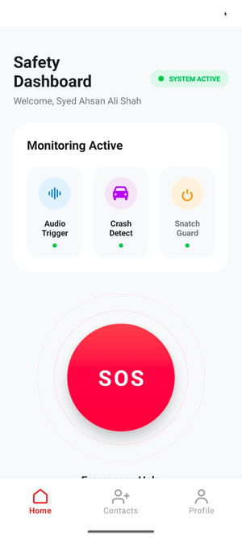
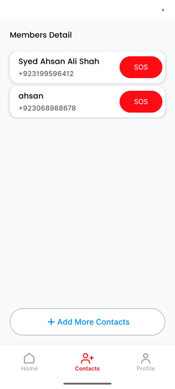
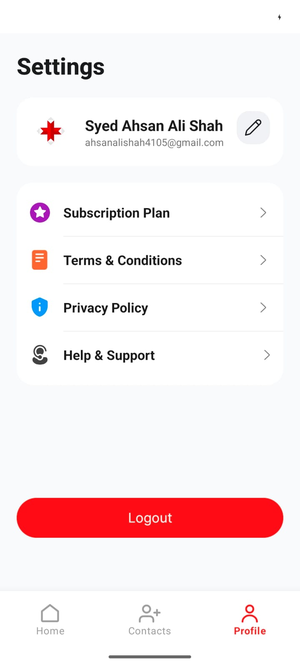

# 🚨 Emergency Responder

> An intelligent Android safety app that detects emergencies in real-time — crashes, snatching, and distress signals — and instantly alerts your emergency contacts.


[](https://kotlinlang.org)


[](https://firebase.google.com)

---

## 🔗 Connect with Me

[](https://www.linkedin.com/in/ahsan-ali-shah-895aa4283/)

---

# 📱 What It Does

Emergency Responder runs silently in the background, monitoring for life-threatening situations.

| Detection Mode | Description |
| :--- | :--- |
| 💥 **Crash Detection** | Accelerometer + gyroscope data are processed using a TensorFlow Lite model to detect vehicle crashes |
| 🏃 **Snatch Guard** | Accessibility Service monitors sudden device displacement or forced phone removal |
| 🎵 **Audio Triggers** | Clap or whistle patterns trigger SOS alerts hands-free |
| 📞 **SOS Blast** | Sends live location instantly to emergency contacts via SMS or call |

---

## 📱 Screenshots

<p align="center">AC
  
  &nbsp;&nbsp;
  
  &nbsp;&nbsp;
  
  &nbsp;&nbsp;
  
</p>

---

# ✨ Features

- 🔐 Authentication  
  - Email & Password Login  
  - Google Sign-In  
  - Forgot Password Flow  

- 📊 Real-Time Dashboard  
  - Live monitoring status  
  - Detection toggles  

- 👥 Emergency Contacts  
  - Add / Remove trusted contacts  

- 👤 Profile Management  
  - Update user information inside app  

- ⚙️ Background Monitoring  
  - Foreground service keeps app active even when closed  

- 📡 Offline Safety  
  - Detection works without internet  
  - Alerts queued until connectivity returns  

---

# 🏗️ Architecture

This project follows:

- **Clean Architecture**
- **MVVM Pattern**
- **SOLID Principles**

```text
┌─────────────────────────────────────┐
│         UI Layer (MVVM)             │
│ Activities · Fragments · ViewModels │
└──────────────┬──────────────────────┘
               │ depends on
┌──────────────▼──────────────────────┐
│         Domain Layer                │
│  Use Cases · Entities · Interfaces  │
│      (No Android dependencies)      │
└──────────────┬──────────────────────┘
               │ implemented by
┌──────────────▼──────────────────────┐
│          Data Layer                 │
│ Repositories · Firebase · Mappers   │
└─────────────────────────────────────┘
```

### Dependency Rule

- Dependencies always point inward
- Domain layer never depends on Android or Firebase
- UI communicates only with ViewModels
- Data layer implements domain interfaces

---

# 🛠️ Tech Stack

| Category | Technology |
| :--- | :--- |
| Language | Kotlin |
| Architecture | Clean Architecture + MVVM |
| Async | Coroutines + Flow |
| Dependency Injection | Hilt |
| UI | ViewBinding + Navigation Component |
| Backend | Firebase Auth + Firestore |
| Machine Learning | TensorFlow Lite |
| Testing | JUnit + Mockk + Coroutines Test |

---

# 🚀 Getting Started

## Prerequisites

- Android Studio Hedgehog or newer
- JDK 17+
- Firebase project with:
  - Firebase Authentication
  - Cloud Firestore

---

## Setup

### 1️⃣ Clone Repository

```bash
git clone https://github.com/ahsanshah4105/Emergency-Responder.git
cd Emergency-Responder
```

### 2️⃣ Add Firebase Configuration

Download `google-services.json` from Firebase Console and place it inside:

```text
/app
```

### 3️⃣ Set JAVA_HOME

```bash
export JAVA_HOME=/path/to/jdk17
```

### 4️⃣ Build Project

```bash
./gradlew assembleDebug
```

### 5️⃣ Run Tests

```bash
./gradlew test
```

---

# 🧪 Testing

The project contains unit tests across all layers.

### Included Tests

- ✅ `LoginUseCaseTest`
- ✅ `SignUpUseCaseTest`
- ✅ `CrashDetectionUseCaseTest`
- ✅ `LoginViewModelTest`

### Testing Tools

- `JUnit`
- `Mockk`
- `kotlinx-coroutines-test`
- `runTest`
- `StandardTestDispatcher`

---

# 📂 Project Structure

```text
app/
│
├── data/
│   ├── mapper/          # Data ↔ Domain converters
│   ├── model/           # DTOs / Firebase models
│   └── repository/      # Repository implementations
│
├── domain/
│   ├── model/           # Core entities
│   ├── repository/      # Repository interfaces
│   └── usecase/         # Business logic
│
└── ui/
    ├── auth/            # Login, Signup, Forgot Password
    ├── dashboard/       # Main dashboard
    ├── contacts/        # Emergency contacts
    └── profile/         # User profile
```

---

# 🤝 Contributing

Pull requests are welcome.

For major changes, please open an issue first to discuss what you would like to change.

---

# 📄 License

This project is open source.

See the `LICENSE` file for more information.

---

# ❤️ Final Note

> Built with care to help people stay safer in emergencies — because every second matters.
